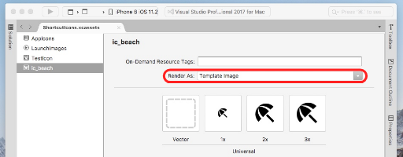

# Using your own icons

The plugin provides a default set of icons based upon the default Quick Action Icons supplied by Apple ([Human Interface Guidelines](https://developer.apple.com/ios/human-interface-guidelines/icons-and-images/system-icons#home-screen-quick-action-icons)), which can be selected using the ShortcutIconType enum.

If these icons don't fit your needs, or don't quite match your color scheme, you can supply your own bespoke images. Select `ShortcutIconType.Custom` and provide the image file name, exactly as you would with any other local image file.

[Local images in Xamarin Forms](https://developer.xamarin.com/guides/xamarin-forms/user-interface/images/#Local_Images)

## Creating a custom icon

Each platform has different specifications for the icons needed for shortcuts.

### Android

Width: 48px  
Height: 48px  

*Along with PNGs and JPGs, Android also supports VectorDrawables. A sample icon can be found [here](resources/SampleIcon.xml)*

* [Android App Shortcuts design guidelines](https://commondatastorage.googleapis.com/androiddevelopers/shareables/design/app-shortcuts-design-guidelines.pdf)  
* [Material icons](https://material.io/icons/)  
  
  
### iOS

Width: 35px  
Height: 35px  

Images should be added to the AssetCatalog with the `Render As:` option set to `Template Image`

* [Human Interface Guidelines - Quick Actions](https://developer.apple.com/ios/human-interface-guidelines/icons-and-images/system-icons#home-screen-quick-action-icons)

### UWP

Width: 44px  
Height: 44px  

* [UWP icon specifications](https://docs.microsoft.com/en-us/windows/uwp/design/shell/tiles-and-notifications/app-assets)  
* [UWP icons](https://docs.microsoft.com/en-us/windows/uwp/design/style/segoe-ui-symbol-font)

  
  
## Icon Templates
* [Sketch Template](resources/SampleIcons.sketch)
* [Adobe XD](resources/SampleIcons.xd)

---

**To see this in the context of an app, please see the [sample](../samples) provided**

---
<= Back to [Table of Contents](README.md)